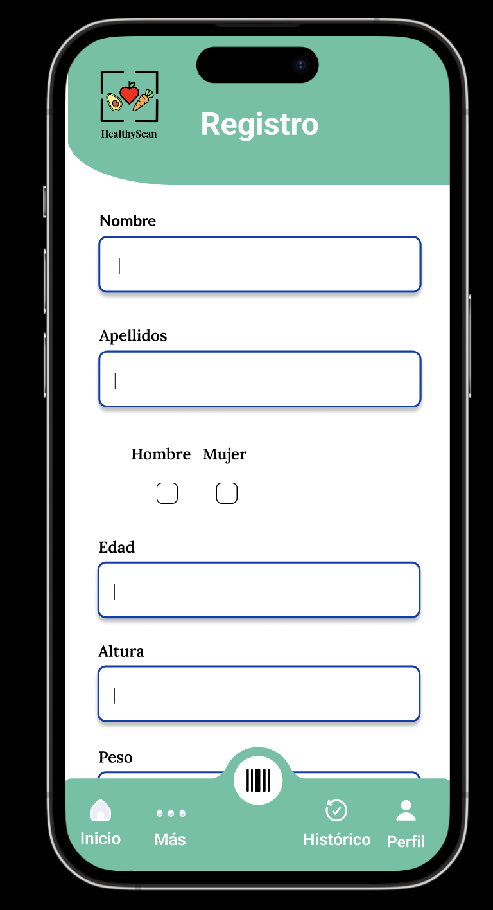
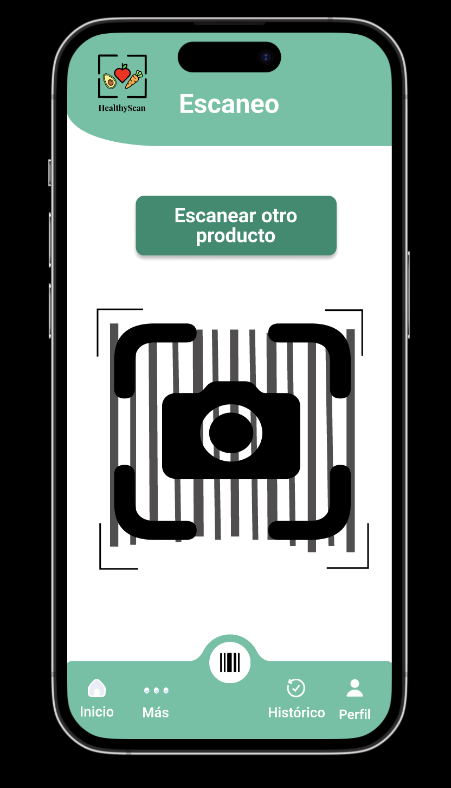
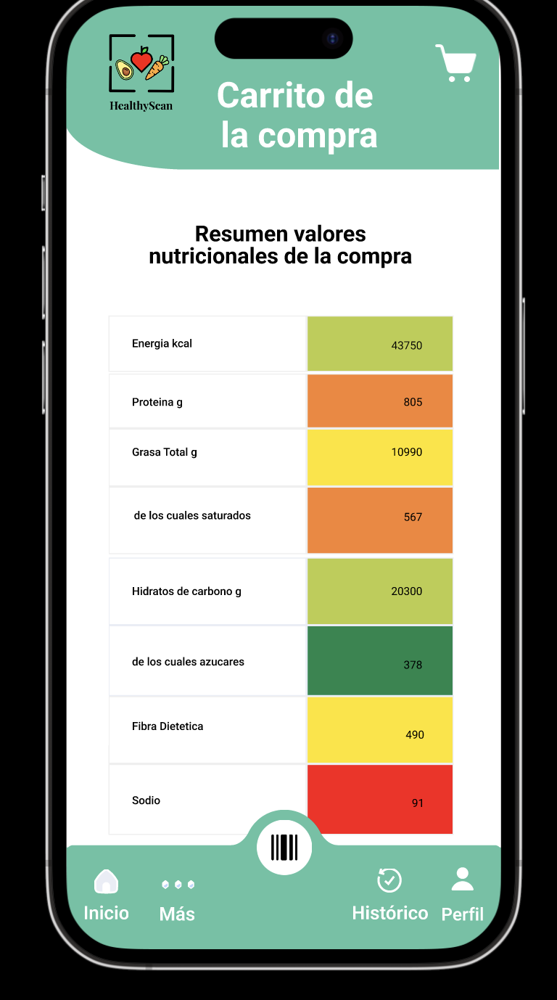
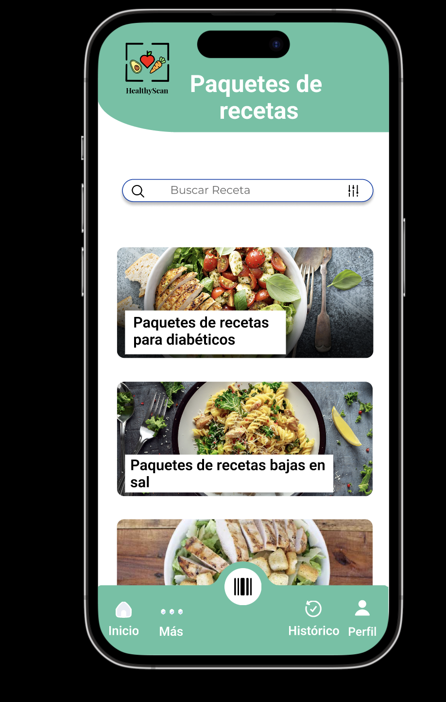
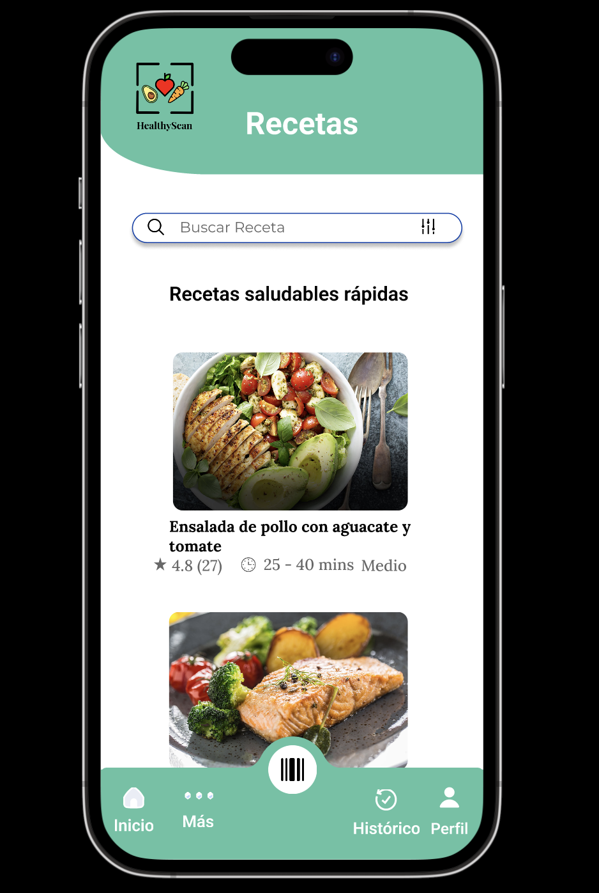
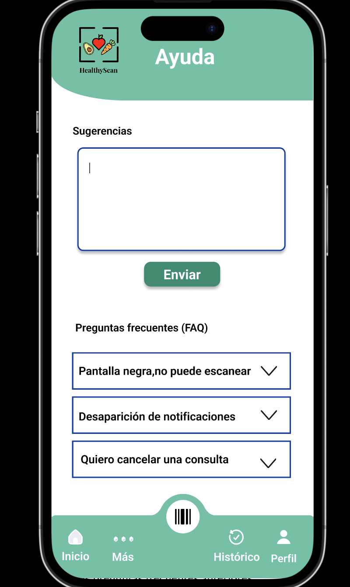
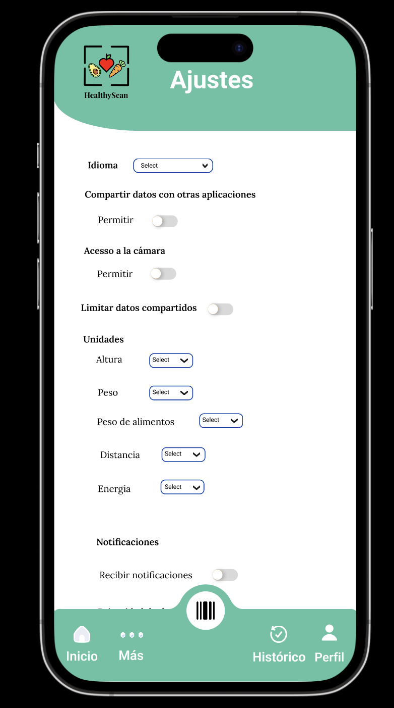

# HealthyScan-App

**HealthyScan** is a mobile application developed as part of a Final Degree Project. Its main goal is to answer the research question:  
*How can an app help improve nutrition by considering an individual's habits and health status?*

The app helps users decide whether supermarket products are suitable for them, taking into account their health conditions and personal habits, aiming to improve nutrition and support overall health and well-being.

## Methodology
- A **user-centered design methodology** was applied, along with heuristic evaluation.  
- Qualitative and quantitative research was conducted with various user profiles to understand their needs and preferences regarding an app that evaluates supermarket products.  
- The design and interaction were created to be intuitive, pleasant, and resemble real-life shopping experiences.

## Main Features
- Scan barcodes or take photos of products.  
- Product recognition using artificial intelligence.  
- Evaluate whether products are suitable according to the user’s health and habits.  
- Additional functionalities to reinforce healthier shopping choices.

## Results
- Heuristic usability tests were positive.  
- A list of future improvements was created to resolve existing issues and optimize the user experience.

## Screenshots

### Home page

### Register page

### Product Scan

### Consultation with nutricionist

### Shopping cart page

### Recipe pack page

### Recipe page

### History page
![history page]images/(history_page.png)

### Help page

### Settings page

## Figma Prototype
You can view and interact with the prototype here:  
[Figma Prototype Link] 
https://www.figma.com/proto/RjZs6oYwF1OMk274tV5mpC/Prototipo?node-id=157-729&t=6iGYFHl7hZgspNVY-1&scaling=scale-down&page-id=0%3A1&starting-point-node-id=1%3A832

## Tools Used
- Design and prototyping: Figma  
- User-centered interaction and usability testing  
