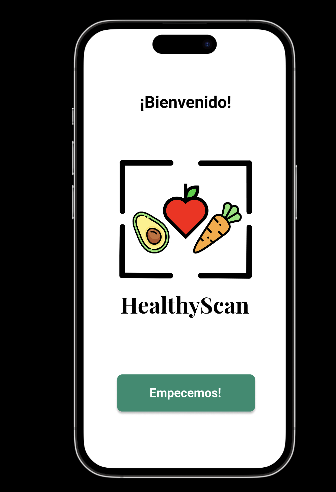
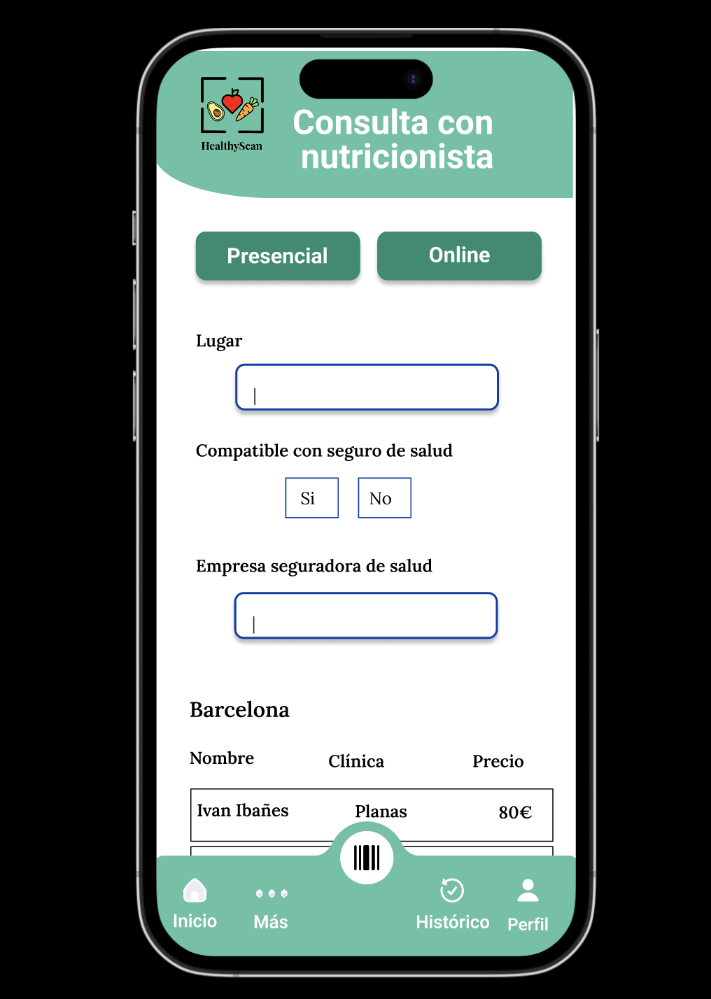

# HealthyScan-App

**HealthyScan** is a mobile application prototype developed as part of a Final Degree Project. Its goal is to answer:  
*How can an app help improve nutrition by considering an individual's habits and health status?*

The app helps users decide whether supermarket products are suitable for them, taking into account their health conditions and personal habits, aiming to improve nutrition and support overall health and well-being.

## Methodology
- A **user-centered design methodology** was applied, along with heuristic evaluation.  
- Qualitative and quantitative research was conducted with various user profiles to understand their needs and preferences regarding an app that evaluates supermarket products.  
- The design and interaction were created to be intuitive, pleasant, and resemble real-life shopping experiences.

## Main Features
- Scan barcodes or take photos of products.  
- Product recognition using artificial intelligence.  
- Evaluate whether products are suitable according to the user’s health and habits.  
- Additional functionalities to reinforce healthier shopping choices.

## Results
- Heuristic usability tests were positive.  
- A list of future improvements was created to resolve existing issues and optimize the user experience.

## Screenshots

### Home page

### Register page

### Scan page

### Consultation with nutritionist

### Shopping cart page

### Recipe pack page

### Recipe page

### History page
![history page]images/(history_page.png)

### Help page

### Settings page

## Figma Prototype
You can view and interact with the prototype here:  
[Figma Prototype Link] 
https://www.figma.com/proto/RjZs6oYwF1OMk274tV5mpC/Prototipo?node-id=157-729&t=6iGYFHl7hZgspNVY-1&scaling=scale-down&page-id=0%3A1&starting-point-node-id=1%3A832

## Tools Used
- Design and prototyping: Figma  
- User-centered interaction and usability testing

- 🚀 Future Improvements & Planned Redesign

The current design is functional but can be enhanced for usability, aesthetics, and user experience. Planned improvements include:

🎨 Color & Contrast

Cohesive, modern color palette.

Sufficient contrast for accessibility.

Subtle gradients or accent colors for visual interest.

📝 Input Fields

Larger fields with more padding.

Rounded corners, subtle shadows, and active state highlights.

Inline validation with visual feedback.

🔤 Typography

Clean, modern fonts.

Clear hierarchy with headings, labels, and buttons.

Increased line spacing and font size.

🧭 Navigation

Larger, evenly spaced icons.

Clear active tab indicators.

Optional sticky navigation for long forms.

📋 Form Layout

Group related fields with subtle boxes or cards.

Consistent spacing and visual separation.

Tooltips or helper text for complex fields.

💡 Visual Hierarchy

Prominent headings and section titles.

Spacing or separators to guide the eye.

Progress indicators for multi-step forms.

🔘 Buttons & Interactions

Rounded buttons with subtle shadows.

Hover, focus, and click animations.

Distinct primary vs secondary actions.

♿ Accessibility

Full keyboard navigation.

ARIA labels for screen readers.

Tested color contrast and font sizes.

📱 Responsiveness

Optimized layout for mobile and tablet.

Flexible grids/cards for small screens.

Adequate touch targets.

✨ Additional Enhancements

Dark mode support.

Subtle micro-interactions for better UX.

Smooth animations and transitions.

Clear error handling with messages.
